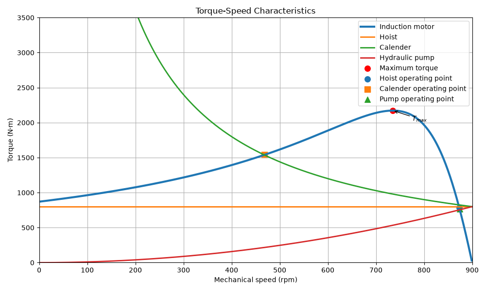
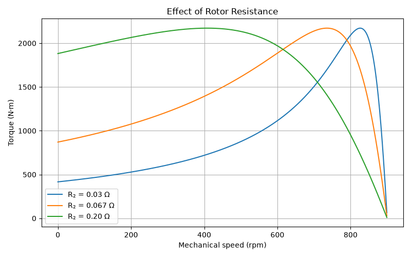

# Induction Motor Thévenin Model

Python implementation of the torque-speed characteristic of a three-phase squirrel-cage induction motor using the Thévenin equivalent circuit.

This project was developed as part of the **Electrical Machines** course in the Electrical Engineering undergraduate program.

---

## Features

- Thévenin equivalent calculation
- Torque-speed characteristic of the induction motor
- Mechanical load models:
  - Hoist (constant torque)
  - Calender (constant power)
  - Hydraulic pump (quadratic torque)
- Maximum torque determination
- Rotor resistance influence analysis
- Category D induction motor representation
- Operating point identification

---

## Project Structure

```
induction-motor-thevenin/

├── main.py          # Main script
├── motor.py         # Induction motor model
├── carga.py         # Mechanical load models
├── images/
│   ├── motor_and_load_torque_speed_curves.png
│   ├── torque_speed_curves_with_operating_points.png
│   └── effect_of_rotor_resistance.png
└── README.md
```

---

## Requirements

- Python 3.x
- NumPy
- Matplotlib

Install the required libraries:

```bash
pip install numpy matplotlib
```

---

## Running

Execute the main script:

```bash
python main.py
```

---

## Results

### Torque-speed characteristic


### Operating points



### Influence of rotor resistance



---

## Author

João Paulo Fonseca

Electrical Engineering Student

Federal Institute of Alagoas (IFAL)
